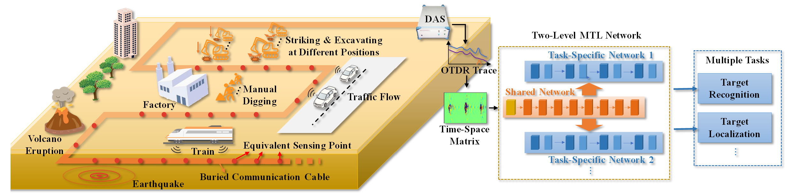
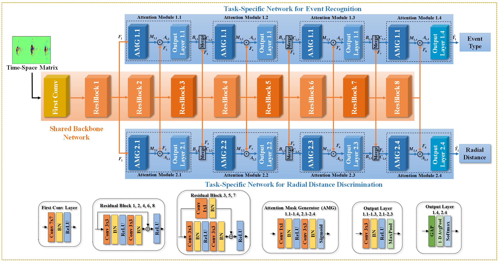

# MTL-DAS.PyTorch
This repository contains the source code of a two level multi-task learning (MTL) model for event type recognition and radial distane discrimination with distributed acoustic sensing (DAS) in the paper: A Highly Efficient Synchronous Event Recognition and 2-D Localization with a Multi-task Learning Network in Distributed Optical-fiber Ground Listening Array.

This repository is being completed.


## Introduction
The proposed two level MTL model is the first multi-task learning approach in the field of fiber-optical distributed acoustic sensor (DAS) for threatening source monitoring. In the hierarchical network, the shared feature extractor in the backbone network improves the feature extraction efficiency by mining data correlations of different tasks, then different higher-level features are selected further in two task-specific subnetworks using separate objective functions to achieve event type recognition and localization respectively.

Field tests proves that the recognition accuracy of event type, the localization error of the radial distance, and the robustness against noises are all better than common single-task networks and the single-level multi-classifiers, while the computational complexity reduces to 67.8% and 19.8% of them. It potentially provides a real-time multi-task processing solution for large-scale or super large-scale DAS array in all kinds of land or marine monitoring applications with fiber IoT.



<br/>




## Environmnet
```
Python~=3.8.10
numpy~=1.21.0
matplotlib~=3.3.4
torch~=1.8.1
ptflops~=0.6.7
scikit-learn~=0.24.2
torchvision~=0.9.1
thop~=0.0.31
torchstat~=0.0.7
seaborn~=0.11.1
pandas~=1.2.5
scipy~=1.6.2
tqdm~=4.61.2
```

## Dataset 
We provide the field multi-task dataset collected with DAS.
The preprocessed dataset and its description are available in [Google Drive](). The original dataset will be uploaded soon.

## Training
Please execute `train.py` for model training and validation, using the command
```
python train.py 
--model                      default='MTL'                            The used model type: MTL, single_event, single_distance, multi_classifier
--GPU_device                 default=True,                            Whether to use GPU
--batch_size                 default=32                               The batch size for training or test
--epoch_num                  default=40                               The Training epoch'
--output_savedir             default='./'                             The saving directory for output files
--dataset_ram                default=True                             Whether to put all the dataset into the memory during training
--trainVal_set_striking      default='./dataset/striking_train'       Path of Training and validation dataset for striking event
--trainVal_set_excavating    default='./dataset/excavating_train'     Path of Training and validation dataset for excavating event

```

## Test
Please execute `test.py` for model test with the test set, using the command
```
python train.py 
--model                      default='MTL'                            The used model type: MTL, single_event, single_distance, multi_classifier
--model_path                                                          Select the path of saved model
--GPU_device                 default=True,                            Whether to use GPU
--output_savedir             default='./'                             The saving directory for output files
--dataset_ram                default=True                             Whether to put all the dataset into the memory during training
--test_set_striking          default='./dataset/striking_test'        Path of test dataset for striking event
--test_set_excavating        default='./dataset/excavating_test'      Path of test dataset for excavating event
```


## Contact
If any link is invalid or any question, please email wangyf@std.uestc.edu.cn.